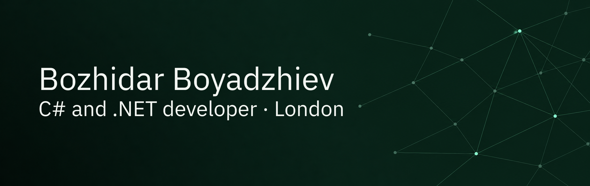

I build and maintain business applications in C# and .NET.

Right now I'm working on Synapse, a workforce management platform where
companies track staff attendance (QR codes and NFC, with Bluetooth beacons
planned) and their work by tasks.

Mostly C#, ASP.NET Core, Entity Framework, SQL Server and Azure.

[boyadzhiev.dev](https://boyadzhiev.dev) · [CV](https://boyadzhiev.dev/cv.html) · [LinkedIn](https://www.linkedin.com/in/bpboyadzhiev/)